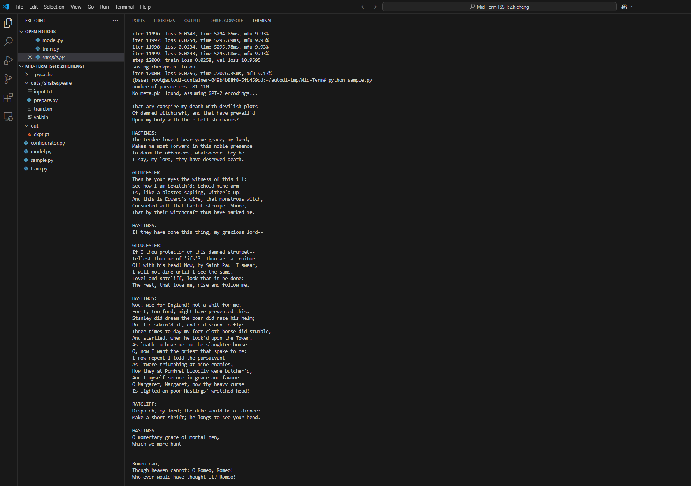

# Med-Term
The little LLM for AI Design course

FileGPT:
        简介：使用基础的Transformer底层架构搭建一个六层的LLM
        源仓库地址：
        模型配置：GPTConfig(block_size=256, vocab_size=50304, n_layer=6, n_head=8, n_embd=768, dropout=0.0, bias=False)
        文件说明：
              model.py 建模文件
              train.py 模型训练文件，可以通过Python train.py --batch_size=32 --compile=False
              sample.py 模型训练后进行文本生成

| 模型         | 参数数量 |
| ------------| -------- |
| gpt2        | 124M     |
| FileGPT     | 81.11M     |

## 数据集加载
通过data/shakespeare/目录下的prepare.py文件进行数据加载，编码后的文件为train.bin以及val.bin \
运行指令： \
cd data/shakespeare/ \
python prepare.py

## 训练
硬件：RTX 3090 24G \
训练约8000步之后达到收敛状态

## 模型使用
模型文件：
        通过百度网盘分享的文件：output
        链接：https://pan.baidu.com/s/11DYIgSnHUSIA7ZSFVNxdkA 
        提取码：aids

## 运行结果
通过在sample.py文件中加入英文提示词即可生成文本

## 结果分析
生成的样本围绕“File:"为初始生成了一段话，证明训练有效
